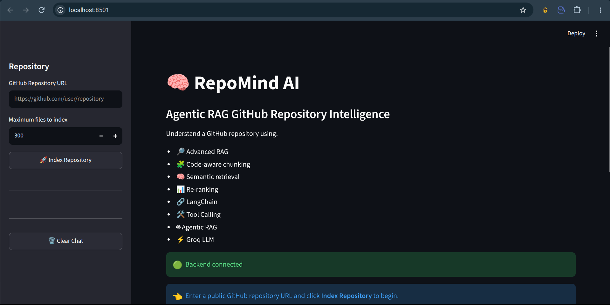

# 🧠 RepoMind AI

### Agentic RAG GitHub Repository Intelligence System

RepoMind AI is an AI-powered developer assistant that helps you understand unfamiliar GitHub repositories using **Advanced RAG, LangChain, Tool Calling, and Agentic RAG**.

Instead of simply retrieving a few similar code chunks and sending them to an LLM, RepoMind can decide **what repository information it needs, which retrieval tool to use, and whether additional investigation is required** before generating an answer.

---

## ✨ What Problem Does It Solve?

Understanding a large or unfamiliar codebase can take a lot of time.

A developer may need to answer questions such as:

- How does authentication work?
- Where is the database connection implemented?
- Which files contain the API routes?
- How does data flow through the application?
- What is the role of a particular service or class?
- Where is a particular feature implemented?

RepoMind AI lets you ask these questions in natural language and uses the repository's indexed source code to generate grounded explanations.

---

## 🖥️ Application Preview

<p align="center">
  
</p>

<p align="center">
  <b>RepoMind AI — Agentic RAG GitHub Repository Intelligence</b>
</p>

---

## 🚀 Key Features

### 🔎 GitHub Repository Ingestion

Enter a public GitHub repository URL and RepoMind:

```text
GitHub Repository
        ↓
Repository Files
        ↓
File Filtering
        ↓
Code Chunking
        ↓
Embeddings
        ↓
ChromaDB
```

---

### 🧩 Code-Aware Chunking

Source code is divided into meaningful chunks before embedding so that retrieval can return useful pieces of the code instead of unnecessarily large files.

---

### 🧠 Semantic Retrieval

RepoMind uses **Sentence Transformers** to convert code and queries into embeddings.

This allows the system to retrieve code based on semantic meaning rather than only exact keyword matches.

---

### 🔄 Query Expansion

A user's original question can be expanded into related search queries to improve retrieval coverage.

For example:

```text
Original:
"How does authentication work?"

Expanded concepts:
- authentication
- login
- JWT
- token validation
- authorization
```

This helps retrieve relevant code spread across different files.

---

### 📊 Re-Ranking

Initial vector retrieval can return several potentially relevant chunks.

RepoMind applies a second ranking stage to prioritize the most useful candidates before sending context to the LLM.

```text
Vector Search
      ↓
Candidate Chunks
      ↓
Re-Ranking
      ↓
Most Relevant Context
```

---

### 🗜️ Context Compression

Only useful information is passed further into the reasoning pipeline.

This helps reduce unnecessary context and keeps the final LLM prompt focused on the repository evidence relevant to the question.

---

# 🤖 Agentic RAG

This is one of the main differences between RepoMind AI and a basic RAG application.

A traditional RAG system usually follows:

```text
Question
   ↓
Retrieve
   ↓
LLM
   ↓
Answer
```

RepoMind uses an agent-driven workflow:

```text
                    User Question
                         ↓
                  LangChain Agent
                         ↓
                  Tool Selection
                         ↓
        ┌────────────────┼────────────────┐
        ↓                ↓                ↓
   Search Code      Search File      Repository
                                     Structure
        │                │                │
        └────────────────┼────────────────┘
                         ↓
                Advanced Retrieval
                         ↓
                     Re-Ranking
                         ↓
                Context Compression
                         ↓
                       Agent
                         ↓
              Need more information?
                    /          \
                  YES           NO
                   ↓             ↓
              More Tools     Final Answer
                   │             ↓
                   └────────→ Groq LLM
```

The agent can investigate the repository through multiple tools instead of relying on a single retrieval step.

---

# 🛠️ Agent Tools

RepoMind currently exposes repository-specific tools to the LangChain agent.

### `search_code`

Used for general semantic questions about the codebase.

Example:

```text
How is authentication implemented?
```

---

### `search_file`

Used when the agent needs to investigate a specific file more deeply.

Example:

```text
Explain the authentication logic in auth.py.
```

---

### `search_by_language`

Used when the agent needs to focus retrieval on a particular programming language.

Example:

```text
Find the Python implementation of authentication.
```

---

### `repository_structure`

Used to understand the indexed files and project organization.

Example:

```text
What files are present in this project?
```

---

# 🔄 Complete RAG Pipeline

```text
GitHub URL
    ↓
GitHub API
    ↓
Repository Ingestion
    ↓
Code Filtering
    ↓
Code-Aware Chunking
    ↓
Sentence Transformer Embeddings
    ↓
ChromaDB
    ↓
User Query
    ↓
LangChain Agent
    ↓
Query Expansion
    ↓
Multi-Query Retrieval
    ↓
Candidate Collection
    ↓
Re-Ranking
    ↓
Context Compression
    ↓
Agent Reasoning
    ↓
Groq LLM
    ↓
Grounded Answer
```

---

# 🏗️ Architecture

```text
┌───────────────────────────────────────────────┐
│                  Streamlit UI                 │
│                                               │
│  GitHub URL → Index Repository → Ask Query   │
└───────────────────────┬───────────────────────┘
                        │
                        ▼
┌───────────────────────────────────────────────┐
│                   FastAPI                     │
│                                               │
│  /repository/index       /ask                │
└───────────────┬───────────────────┬───────────┘
                │                   │
                ▼                   ▼
       ┌────────────────┐   ┌──────────────────┐
       │ GitHub Service │   │ LangChain Agent  │
       └───────┬────────┘   └────────┬─────────┘
               │                     │
               ▼                     ▼
        ┌─────────────┐       ┌───────────────┐
        │ Code Chunker│       │ Agent Tools   │
        └──────┬──────┘       └───────┬───────┘
               │                      │
               ▼                      ▼
        ┌─────────────┐       ┌───────────────┐
        │  Embeddings │       │ Advanced RAG  │
        └──────┬──────┘       └───────┬───────┘
               │                      │
               ▼                      ▼
        ┌─────────────┐       ┌───────────────┐
        │  ChromaDB   │◄──────│ Re-Ranker     │
        └─────────────┘       └───────┬───────┘
                                      │
                                      ▼
                              ┌───────────────┐
                              │ Context       │
                              │ Compression   │
                              └───────┬───────┘
                                      │
                                      ▼
                              ┌───────────────┐
                              │   Groq LLM    │
                              └───────────────┘
```

---

# 🧰 Tech Stack

| Layer | Technology |
|---|---|
| Language | Python |
| Backend | FastAPI |
| Frontend | Streamlit |
| LLM | Groq |
| Agent Framework | LangChain |
| Embeddings | Sentence Transformers |
| Vector Database | ChromaDB |
| Repository Source | GitHub API |
| RAG | Advanced / Agentic RAG |

---

# 📁 Project Structure

```text
repomind-ai/
│
├── backend/
│   ├── __init__.py
│   ├── config.py
│   ├── github_service.py
│   ├── chunker.py
│   ├── embeddings.py
│   ├── vector_store.py
│   ├── retriever.py
│   ├── reranker.py
│   ├── query_processor.py
│   ├── context_compressor.py
│   ├── tools.py
│   ├── agent.py
│   └── main.py
│
├── frontend/
│   └── streamlit_app.py
│
├── data/
│   ├── repositories/
│   └── chroma/
│
├── docs/
│   └── images/
│       └── repomind-ui.png
│
├── .env
├── .env.example
├── .gitignore
├── requirements.txt
└── README.md
```

---

# ⚙️ Installation

### 1. Clone the repository

```bash
git clone <your-repository-url>
cd repomind-ai
```

### 2. Create a virtual environment

```bash
python3 -m venv .venv
source .venv/bin/activate
```

### 3. Install dependencies

```bash
pip install -r requirements.txt
```

---

# 🔑 Environment Variables

Create a `.env` file in the project root:

```env
GROQ_API_KEY=your_groq_api_key
GROQ_MODEL=llama-3.3-70b-versatile

GITHUB_TOKEN=your_github_token

EMBEDDING_MODEL=all-MiniLM-L6-v2

CHROMA_PATH=data/chroma
COLLECTION_NAME=repomind_code

APP_NAME=RepoMind AI
DEBUG=false
```

### Security

Never commit `.env`.

The project already ignores it through `.gitignore`.

Commit `.env.example` instead.

---

# ▶️ Running the Application

## Start the FastAPI backend

From the project root:

```bash
uvicorn backend.main:app --reload
```

Backend:

```text
http://127.0.0.1:8000
```

API documentation:

```text
http://127.0.0.1:8000/docs
```

---

## Start the Streamlit frontend

Open another terminal:

```bash
source .venv/bin/activate
streamlit run frontend/streamlit_app.py
```

Then open the Streamlit URL shown in the terminal.

---

# 💬 Example Questions

After indexing a repository, you can ask:

```text
How does this project work?
```

```text
Explain the authentication flow.
```

```text
Where is the database connection implemented?
```

```text
Which files contain API routes?
```

```text
Explain the main entry point.
```

```text
How does data flow from the API to the database?
```

```text
Where is error handling implemented?
```

```text
Explain the relationship between the service and repository layers.
```

```text
What are the most important files in this project?
```

---

# 🆚 Basic RAG vs RepoMind AI

| Capability | Basic RAG | RepoMind AI |
|---|---:|---:|
| Vector Search | ✅ | ✅ |
| Code Chunking | ✅ | ✅ |
| Semantic Retrieval | ✅ | ✅ |
| Query Expansion | ❌ | ✅ |
| Multi-Query Retrieval | ❌ | ✅ |
| Re-Ranking | ❌ | ✅ |
| Context Compression | ❌ | ✅ |
| LangChain | ❌ | ✅ |
| Tool Calling | ❌ | ✅ |
| Agentic Retrieval | ❌ | ✅ |
| Multiple Investigation Steps | ❌ | ✅ |

---

# 🎯 Why I Built It

RepoMind AI was built to explore how modern LLM applications can move beyond simple prompt + retrieval architectures.

The project combines:

```text
LLM Fundamentals
        ↓
Embeddings
        ↓
Vector Database
        ↓
RAG
        ↓
Advanced RAG
        ↓
LangChain
        ↓
Tool Calling
        ↓
Agentic RAG
```

The goal is to create a practical developer tool while learning how **retrieval, reasoning, tools, and agents work together in production-oriented LLM applications**.

---

# 🚀 Future Improvements

Planned improvements include:

- AST-based code parsing
- Function-level retrieval
- Class-level retrieval
- Hybrid BM25 + vector search
- Cross-encoder re-ranking
- Parent-child retrieval
- Repository dependency graphs
- GitHub Issues analysis
- Pull Request analysis
- Commit history analysis
- Code change analysis
- Automatic architecture diagrams
- Code quality analysis
- Security analysis
- Multi-agent repository analysis
- Repository documentation generation
- Semantic caching

---

# 📌 Learning Highlights

This project demonstrates practical understanding of:

- LLM application development
- Prompt engineering
- Embeddings
- Vector databases
- Retrieval-Augmented Generation
- Advanced RAG
- Query expansion
- Re-ranking
- Context compression
- LangChain
- Tool calling
- Agentic RAG
- FastAPI
- Streamlit
- GitHub API integration

---

# 👨‍💻 Author

**Soumya Tyagi**

BTech — Artificial Intelligence & Machine Learning

Focused on:

- AI / ML
- Generative AI
- RAG
- Agentic AI
- LLM Applications
- Software Development

---

## ⭐ If you find this project useful

Give the repository a ⭐ and feel free to explore the code.
